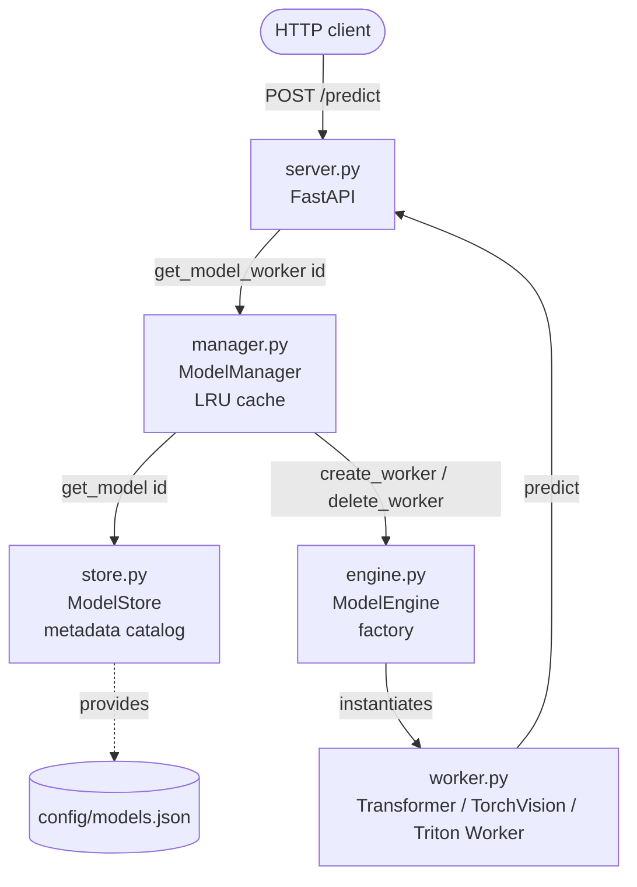
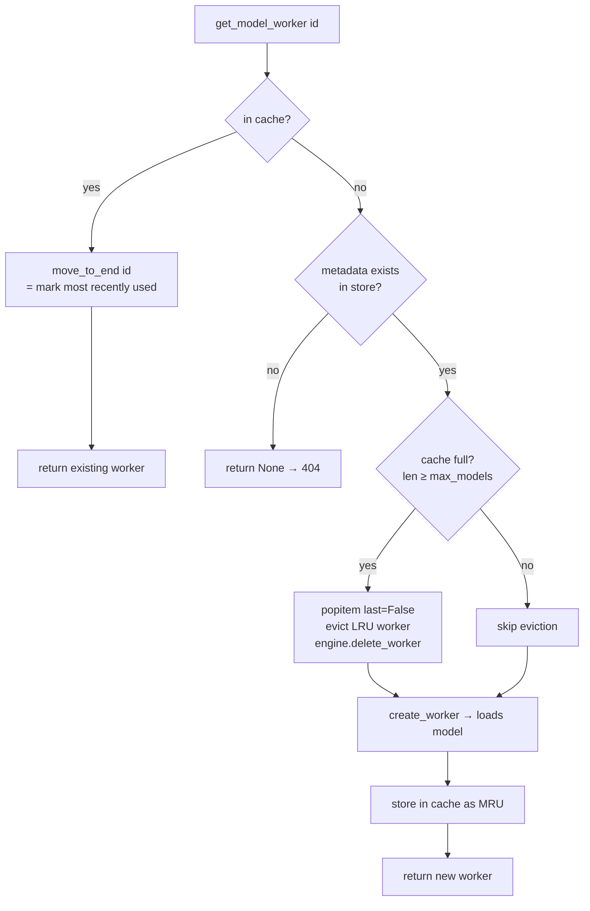
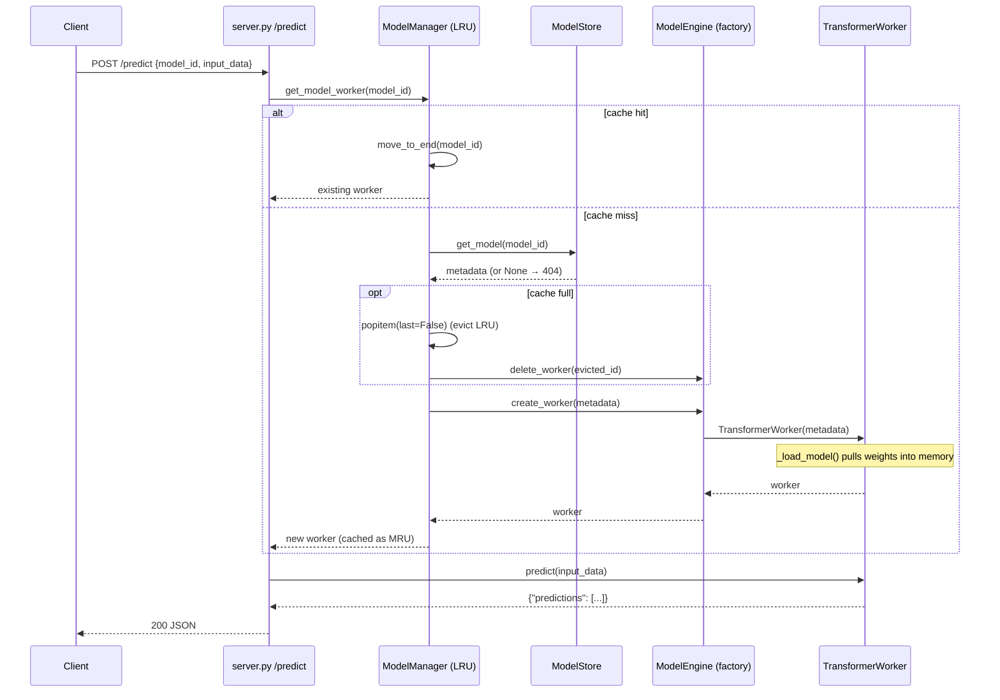

# Tutorial: Multi-Model Serving with an LRU Model Cache

This project (`ch03/multi_model_serving`) answers a different question than the
single-model streaming demo. That one was about **concurrency** (asyncio + threads). This
one is about **resource management**: *how do you serve many models when you can only afford
to keep a few loaded in memory at once?*

The answer here is an **LRU (Least Recently Used) cache of models**, wrapped in a couple of
classic design patterns (Factory + Strategy). There is no threading or asyncio subtlety —
everything is straightforward synchronous code — so you can focus purely on the
*architecture*.

---

## 1. The problem in one sentence

You have **4 models** registered but only enough memory for **2 loaded at a time**. So you
must **load models on demand** and **evict the least-recently-used one** when you run out of
room — exactly like a CPU cache or a browser tab-suspension policy, but for ML models.

```
Registered models (config/models.json)        Memory budget: max_models = 2
────────────────────────────────────          ─────────────────────────────
  • sentiment  (transformers)                    ┌───────────────────────┐
  • spam       (transformers)                     │  cache slot 1 (MRU)   │
  • mobilenet  (torchvision)          load  ───►  │  cache slot 2 (LRU)   │ ──► evict
  • densenet   (triton)                            └───────────────────────┘
```

---

## 2. The five components (and why each exists)

| Component | File | Job | Analogy |
|---|---|---|---|
| **Server** | `app/server.py` | FastAPI endpoints `/predict`, `/models` | the front desk |
| **Store** | `app/store.py` | holds model *metadata* (the catalog) | the library card catalog |
| **Manager** | `app/manager.py` | the **LRU cache** — decides what's loaded | the librarian |
| **Engine** | `app/engine.py` | **factory** that builds the right worker | the workshop |
| **Worker** | `app/worker.py` | actually loads a model & runs inference | the machine |

A key mental split: **Store = "what models *could* exist"** (cheap metadata, always in
memory) vs. **Manager/Engine/Worker = "what models are *actually loaded* right now"**
(expensive, capped at 2).



---

## 3. The catalog: `ModelStore` (`store.py`)

The store just reads `config/models.json` at startup and keeps a dict of `ModelMetadata`
objects. Metadata is tiny — an id, a human name, a `type` (text/image), a `framework`, a
version, a description. **No model weights are loaded here.** This is the cheap "what
exists" layer.

```python
class ModelMetadata(BaseModel):
    id: str          # e.g. "550e8400-...".  What the client sends.
    name: str        # e.g. "distilbert-...-sst-2-english". HF/torchvision/triton name.
    type: str        # "text" | "image"
    framework: str   # "transformers" | "torchvision" | "triton"  ← picks the worker class
    version: str
    description: str
```

The `framework` field is the important one: it's what the Engine uses to decide *which kind
of worker* to build.

There are four models in `config/models.json`: two `transformers` (sentiment, spam), one
`torchvision` (mobilenet), one `triton` (densenet).

---

## 4. The heart: `ModelManager` — the LRU cache (`manager.py`)

This is the component worth studying closely. It keeps an `OrderedDict` as its cache:

```python
class ModelManager:
    def __init__(self, model_store, max_models=2):
        self.model_store = model_store
        self.max_models = max_models
        self.model_cache = OrderedDict()   # id -> worker, ordered by recency
        self.model_engine = ModelEngine()
```

### Why `OrderedDict`?

An `OrderedDict` remembers **insertion/access order**, and gives you two methods that make
LRU trivial:

- `move_to_end(key)` — mark an entry as **most recently used**.
- `popitem(last=False)` — remove the **oldest** (least recently used) entry.

So "the front of the dict = least recently used, the back = most recently used."

### The one method that matters: `get_model_worker`

```python
def get_model_worker(self, model_id):
    # 1. CACHE HIT: already loaded → mark as most-recently-used and return it
    if model_id in self.model_cache:
        self.model_cache.move_to_end(model_id)
        return self.model_engine.get_worker(model_id)

    # 2. Look up metadata; unknown id → None (server turns this into 404)
    model_metadata = self.model_store.get_model(model_id)
    if not model_metadata:
        return None

    # 3. CACHE FULL: evict the least-recently-used model to free a slot
    if len(self.model_cache) >= self.max_models:
        id, _ = self.model_cache.popitem(last=False)   # oldest entry
        self.model_engine.delete_worker(id)            # drop the worker → frees memory

    # 4. CACHE MISS: build the worker (loads weights), cache it, return it
    self.model_cache[model_id] = self.model_engine.create_worker(model_metadata)
    return self.model_cache[model_id]
```

Read those four branches as a decision tree:



The two subtle-but-important lines:

- **`move_to_end` on a hit** is what keeps "recently used" models alive. Without it, the
  cache would evict by insertion order (FIFO), not by usage (LRU).
- **`delete_worker` on eviction** is what actually frees the memory. Removing the entry from
  `model_cache` alone isn't enough — the Engine holds its *own* reference (see §5), so both
  must drop it before Python can garbage-collect the model weights.

---

## 5. The factory: `ModelEngine` (`engine.py`)

The Manager decides *when* to load/evict; the Engine decides *how* to build a worker for a
given framework. This is the **Factory pattern**:

```python
def create_worker(self, model_metadata):
    if model_metadata.id not in self.workers:
        if model_metadata.framework == "transformers":
            self.workers[model_metadata.id] = TransformerWorker(model_metadata)
        elif model_metadata.framework == "torchvision":
            self.workers[model_metadata.id] = TorchVisionWorker(model_metadata)
        elif model_metadata.framework == "triton":
            self.workers[model_metadata.id] = TritonWorker(model_metadata)
        else:
            raise ValueError(f"Unsupported framework: {model_metadata.framework}")
    return self.workers[model_metadata.id]
```

The Engine keeps its own `self.workers` dict (`id -> worker`). So **there are two
registries** that the Manager keeps in lock-step:

- `ModelManager.model_cache` — the *ordering* (who's LRU/MRU), capped at `max_models`.
- `ModelEngine.workers` — the *actual worker objects*.

That's why eviction is a two-step dance: `model_cache.popitem(...)` **and**
`engine.delete_worker(...)`. If you only did one, either the ordering or the object would
leak. (A cleaner design might fold these into one structure — a good exercise to try.)

---

## 6. The strategy: `ModelWorker` and subclasses (`worker.py`)

`ModelWorker` is an **abstract base class** (ABC) defining a two-method contract:

```python
class ModelWorker(ABC):
    def __init__(self, model_metadata):
        self.model_metadata = model_metadata
        self.model = None
        self._load_model()        # ← subclass fills this in; runs at construction time

    @abstractmethod
    def _load_model(self): ...    # HOW to load this framework's model
    @abstractmethod
    def predict(self, input_data): ...  # HOW to run inference
```

Each subclass is a **Strategy** — same interface, framework-specific guts:

| Worker | `_load_model` loads… | `predict` does… |
|---|---|---|
| `TransformerWorker` | HF `AutoModelForSequenceClassification` + tokenizer | tokenize → forward → softmax → class probs |
| `TorchVisionWorker` | `mobilenet_v2` + image transforms | open image → transform → forward → softmax |
| `TritonWorker` | POSTs a *load* request to a **remote Triton server** | builds `InferInput` tensors → `client.infer(...)` |

Two things worth noticing:

1. **Loading happens in `__init__`.** The moment `create_worker` constructs a worker, the
   model weights are pulled into memory (or, for Triton, loaded on the remote server). So
   "creating a worker" == "loading a model." That's why the Manager treats worker creation
   as the expensive, capacity-limited operation.

2. **`TritonWorker` is special — the model doesn't live in *this* process at all.** It's a
   thin client to an external Triton Inference Server (see the README's Docker setup).
   `_load_model` calls Triton's `/v2/repository/.../load` HTTP endpoint, and — importantly —
   `__del__` calls the matching `/unload`. So when the LRU cache evicts a `TritonWorker` and
   Python garbage-collects it, `__del__` fires and the model is unloaded *on the Triton
   server* too. The eviction policy reaches across the network.

---

## 7. End-to-end: a request's journey



---

## 8. Watch the LRU cache in action

Start the server and send a few requests with the model ids from `config/models.json`:

```bash
python -m app.server        # serves on port 8001

# See what's registered vs. loaded
curl http://localhost:8001/models

# 1) sentiment  → cache = [sentiment]
curl -X POST http://localhost:8001/predict -H "Content-Type: application/json" \
  -d '{"model_id": "550e8400-e29b-41d4-a716-446655440000", "input_data": "This movie was great!"}'

# 2) spam       → cache = [sentiment, spam]   (now full)
curl -X POST http://localhost:8001/predict -H "Content-Type: application/json" \
  -d '{"model_id": "6ba7b810-9dad-11d1-80b4-00c04fd430c8", "input_data": "Win a free iPhone now!"}'

# 3) mobilenet  → cache full → EVICT sentiment (LRU) → cache = [spam, mobilenet]
curl -X POST http://localhost:8001/predict -H "Content-Type: application/json" \
  -d '{"model_id": "7c9e6679-7425-40de-944b-e07fc1f90ae7", "input_data": "tests/images/cat1.jpg"}'
```

Call `/models` again between steps and watch `loaded_models` change while
`available_models` stays constant — the clearest demonstration of the "catalog vs. loaded"
split from §2. If you re-request `sentiment` after step 3, you'll see a *reload* (cache
miss), because it was evicted.

---

## 9. Design patterns cheat-sheet

| Pattern | Where | Why it's used here |
|---|---|---|
| **LRU cache** | `ModelManager` + `OrderedDict` | serve N models with memory for only `max_models` |
| **Factory** | `ModelEngine.create_worker` | one place decides which worker class to build from `framework` |
| **Strategy** | `ModelWorker` ABC + subclasses | uniform `predict()` interface, framework-specific implementation |
| **Registry / catalog** | `ModelStore` + `models.json` | decouple "what models exist" from "what's loaded" |
| **RAII-style cleanup** | `TritonWorker.__del__` | eviction → GC → remote unload, no manual bookkeeping |

---

## 10. How this contrasts with the single-model streaming demo

| | `single_model_llm_serving` | `multi_model_serving` (this) |
|---|---|---|
| Core challenge | **concurrency** (stream tokens without blocking) | **resource management** (fit many models in little memory) |
| Key mechanism | asyncio event loop + background thread + `run_coroutine_threadsafe` | LRU cache + factory + strategy |
| Endpoints | `/generate_stream`, `/generate`, … | `/predict`, `/models` |
| Concurrency model | async + threads + a model *process* | plain synchronous calls |
| Number of models | one (facebook/opt-125m) | many, swapped in/out on demand |

Together the two demos cover the two big axes of model serving: **making one model fast and
responsive**, and **making many models fit**. See
[`ch03_STREAMING_ASYNCIO_TUTORIAL.md`](./ch03_STREAMING_ASYNCIO_TUTORIAL.md) for the first.

---

## 11. Summary — the one thing to remember

> Multi-model serving here is an **LRU cache of loaded models**. `/predict` asks the
> `ModelManager` for a worker; if it's cached, it's marked most-recently-used and reused; if
> not, and the cache is full, the **least-recently-used** model is **evicted** (dropped from
> both the Manager's `OrderedDict` and the Engine's registry, freeing its memory) before the
> requested model is built by the **Engine factory** and run by a framework-specific
> **Worker strategy**.
