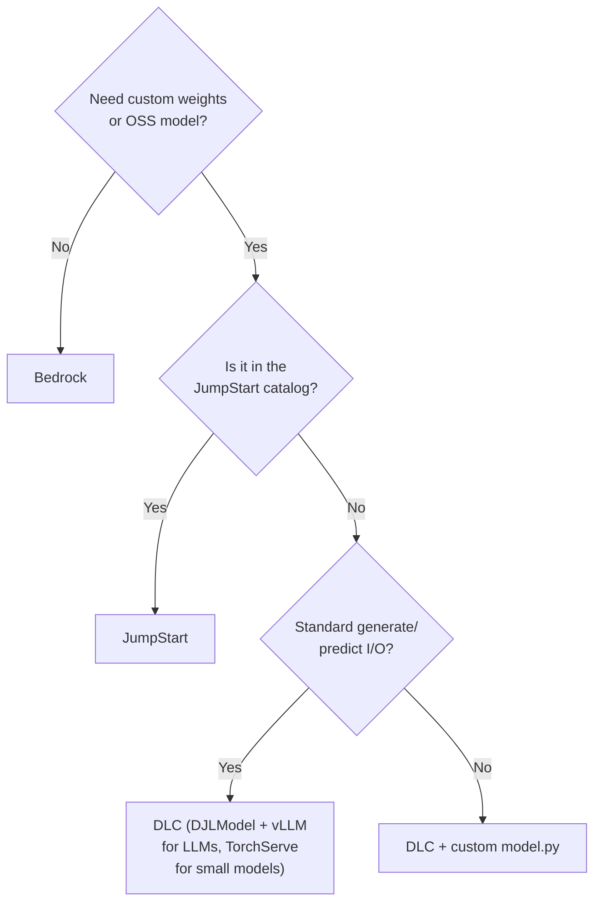

# Tutorial: Four Ways to Serve LLMs on AWS (Bedrock → JumpStart → DLC → Custom Handler)

The ch03 tutorials were about building serving infrastructure *yourself* (asyncio streaming,
LRU model caches). Chapter 4 (`ch04/`) flips the question: **how much of that should you even
build, given AWS will run it for you?**

The four notebooks in `ch04` form a **managed → custom spectrum**. Each step down the ladder
gives you more control and more responsibility:

```
 more managed ◄──────────────────────────────────────────────► more custom

 ┌──────────┐   ┌────────────┐   ┌──────────────┐   ┌────────────────────┐
 │ Bedrock  │   │ JumpStart  │   │ DLC          │   │ DLC Customization  │
 │ just an  │   │ one-click  │   │ your model,  │   │ your model AND     │
 │ API call │   │ deploy to  │   │ AWS's serving│   │ your inference     │
 │          │   │ your GPU   │   │ container    │   │ code (model.py)    │
 └──────────┘   └────────────┘   └──────────────┘   └────────────────────┘
  no infra       own endpoint     own endpoint        own endpoint
  pay per token  pay per hour     pay per hour        pay per hour
```

> Note on the source notebooks: the DLC ones (`ch04/dlc`, `ch04/dlc_customization`) are
> explicitly trimmed pseudo-code distilled from AWS tutorials — study them for the *shape*
> of the workflow, not as copy-paste-runnable scripts. The Bedrock and JumpStart notebooks
> are close to runnable.

---

## 1. Level 0 — Amazon Bedrock: LLM inference as a pure API call

**Notebook:** `ch04/bedrock/aws_bedrock_examples.ipynb`

Bedrock is AWS's fully-managed, **serverless** foundation-model service: one unified API in
front of models from Anthropic, Meta, Amazon, Mistral, etc. There is **no endpoint, no
instance, no container, no cleanup** — you pay per token, like calling OpenAI.

The entire "deployment" is a boto3 client:

```python
import boto3, os

# Bedrock supports API-key ("bearer token") auth — no access key/secret needed
os.environ['AWS_BEARER_TOKEN_BEDROCK'] = "<your bedrock api key>"

client = boto3.client(
    service_name="bedrock-runtime",   # runtime = inference; "bedrock" = control plane
    region_name="us-west-2",
)
```

Two details worth remembering:

- **`bedrock-runtime` vs `bedrock`**: the runtime client is for inference (`converse`,
  `invoke_model`); the plain `bedrock` client is for management (listing models, etc.).
- **`us.` model-ID prefix** = a *cross-region inference profile* — AWS routes your request
  to capacity across several regions.

Inference uses the **Converse API**, which normalizes the message format across all Bedrock
models (so you don't write per-vendor request bodies):

```python
model_id = "us.anthropic.claude-3-5-sonnet-20240620-v1:0"
messages = [{"role": "user", "content": [{"text": "Hello! Can you tell me about Amazon Bedrock?"}]}]

response = client.converse(modelId=model_id, messages=messages)
print(response['output']['message']['content'][0]['text'])
```

**When Bedrock is enough:** you want a frontier model, you don't need custom weights or
serving-stack control, and pay-per-token beats keeping a GPU warm.

---

## 2. Level 1 — SageMaker JumpStart: one-click deploy of a catalog model

**Notebook:** `ch04/jumpstart/aws_jumpstart.ipynb`

JumpStart is a **catalog of pre-packaged open-source models**. You pick a `model_id`, and
the SDK already knows the right container image, model artifacts, and serving defaults.
The big shift from Bedrock: **you now own a real endpoint on a real GPU instance**, billed
per hour whether or not requests arrive.

Auth also shifts: instead of a bearer token you use standard AWS credentials plus a
**SageMaker execution role** (the IAM role the endpoint assumes to pull models and images):

```python
import sagemaker
from sagemaker.jumpstart.model import JumpStartModel

sess = sagemaker.Session()
sagemaker_execution_role = 'arn:aws:iam::....'

model = JumpStartModel(
    model_id="huggingface-llm-mistral-7b-instruct",
    model_version="*",                 # latest
    instance_type="ml.g5.2xlarge",     # you pick (and pay for) the hardware
    role=sagemaker_execution_role,
    env={
        "SAGEMAKER_MODEL_SERVER_WORKERS": "1",
        "SAGEMAKER_CONTAINER_LOG_LEVEL": "20",
    },
)

predictor = model.deploy(
    initial_instance_count=1,
    endpoint_name="my-custom-mistral-endpoint",
    role=sagemaker_execution_role,
    sagemaker_session=sess,
)
```

That's the whole recipe — no container selection, no artifact packaging. The `env` dict is
your only serving-config knob at this level.

**Don't forget:** the endpoint bills continuously. When done:

```python
predictor.delete_endpoint()
predictor.delete_model()
```

**When JumpStart is enough:** you want a well-known open-source model on your own dedicated
endpoint (data isolation, predictable latency) with minimal code.

---

## 3. Level 2 — Deep Learning Containers: your model, AWS's serving stack

**Notebook:** `ch04/dlc/aws_dlc_serving.ipynb`

A **DLC (Deep Learning Container)** is an AWS-maintained Docker image with a serving stack
pre-installed (TorchServe, or DJL with vLLM/DeepSpeed). The deal: **you bring the model
artifact, AWS maintains the image**. The notebook shows two flavors.

### 3a. TorchServe path — for your own (smaller) PyTorch model

Three steps: resolve the image, package the model, wire them together in a `Model`.

**Resolve the DLC image URI** programmatically (never hand-write ECR URIs):

```python
baseimage = sagemaker.image_uris.retrieve(
    framework="pytorch",
    region="<region>",
    py_version="py310",
    image_scope="inference",
    version="2.0.1",
    instance_type="ml.g4dn.16xlarge",
)
```

**Package with `torch-model-archiver`** — the TorchServe artifact format bundles four things
(network definition, weights, handler, config):

```bash
torch-model-archiver --model-name mnist --version 1.0 \
  --model-file workspace/mnist-dev/mnist.py \            # network definition
  --serialized-file workspace/mnist-dev/mnist_cnn.pt \   # weights
  --handler workspace/mnist-dev/mnist_handler.py \       # pre/post-processing
  --config-file workspace/mnist-dev/model-config.yaml \
  --archive-format tgz
aws s3 cp mnist.tar.gz s3://{bucket}/{prefix}/models/mnist.tar.gz
```

**Wire artifact + image into a generic `sagemaker.Model`** and deploy:

```python
model = Model(model_data=f'{output_path}/mnist.tar.gz',
              image_uri=baseimage,
              predictor_cls=Predictor,
              name="mnist")

predictor = model.deploy(
    instance_type='ml.g4dn.xlarge',
    initial_instance_count=1,
    endpoint_name='torchserve-endpoint-1',
    serializer=JSONSerializer(),
    deserializer=JSONDeserializer())
```

Compare with JumpStart: same `deploy()` call at the end, but *you* supplied the two halves
(`model_data` + `image_uri`) that JumpStart resolved for you.

### 3b. DJL / LMI path — for large LLMs (this is the one to remember)

For big models, AWS's **LMI (Large Model Inference)** containers run **DJL Serving** with
backends like **vLLM**. The `DJLModel` class takes a Hugging Face model ID directly — no
archiving, no S3 upload — and auto-configures large-model serving from the architecture:

```python
model = DJLModel(
    model_id="meta-llama/Meta-Llama-3.1-8B-Instruct",   # pulled from HF at load time
    role=iam_role,
    env={
        "HF_TOKEN": "<hf token for gated models>",
        "OPTION_TENSOR_PARALLEL_DEGREE": "4",       # shard across 4 GPUs
        "OPTION_SERVING_LOADER": "vllm",            # backend engine
        "OPTION_MAX_ROLLING_BATCH_SIZE": "128",     # continuous batching
    },
)

predictor = model.deploy(
    instance_type="ml.g5.12xlarge",   # 4-GPU instance to match TP degree
    initial_instance_count=1,
    endpoint_name=sagemaker.utils.name_from_base("llama-8b-endpoint"))
```

The `OPTION_*` env vars are the LMI configuration surface, and they map straight onto the
LLM-serving concepts from earlier chapters:

| Env var | Concept |
|---|---|
| `OPTION_TENSOR_PARALLEL_DEGREE=4` | tensor parallelism — split each layer across 4 GPUs |
| `OPTION_SERVING_LOADER=vllm` | inference engine (vLLM = PagedAttention KV-cache) |
| `OPTION_MAX_ROLLING_BATCH_SIZE=128` | rolling/continuous batching for throughput |
| `HF_TOKEN` | auth for gated models (Llama) |

Note the instance choice is *coupled* to the config: TP degree 4 needs a 4-GPU box
(`ml.g5.12xlarge`), unlike the single-GPU `ml.g4dn.xlarge` for MNIST.

**When DLC is right:** your model isn't in a catalog (custom weights, fine-tune, or a big
gated HF model) but the *serving logic* is standard — you just don't want to build or patch
the container.

---

## 4. Level 3 — DLC customization: write your own inference handler

**Notebook:** `ch04/dlc_customization/aws_dlc_serving_customization.ipynb`

Sometimes the default handler doesn't fit — the worked example is a **text-embedding
service** that must return raw vectors, not generated text. The DJL container has a
"Python engine" escape hatch: you ship a folder with three files, and the container runs
*your* code for every request.

```
my-own-llm/
├── serving.properties   # DJL config: which engine, where the code/model lives
├── requirements.txt     # extra pip deps installed into the container at load time
└── model.py             # YOUR inference handler (the DJL Python contract)
```

**`serving.properties`** — selects the Python engine and points at your S3 location:

```properties
engine=Python
option.s3url=s3://sagemaker-us-west-2-<account>/large-model-lmi/code/my-own-llm
```

**`model.py`** — the heart of it. DJL's contract is a single entry point,
`handle(inputs: Input) -> Output`, with three idioms you must implement:

```python
from djl_python import Input, Output

model = None
tokenizer = None

def handle(inputs: Input):
    global model, tokenizer
    if not model:                                   # idiom 1: lazy global init —
        model, tokenizer = initialize(inputs.get_properties())   # load once, reuse forever

    if inputs.is_empty():                           # idiom 2: the server sends an EMPTY
        return None                                 # request at startup to warm the model

    data = inputs.get_as_json()                     # idiom 3: JSON in ({"inputs": [...]}),
    res = run_inference(data["inputs"], model, tokenizer)
    return Output().add_as_json(res)                # JSON-serializable out
```

The inference routine itself is ordinary PyTorch — batched encoding on CUDA with mean
pooling over token embeddings:

```python
def run_inference(input_texts, model, tokenizer):
    max_batch_size = 128
    z = torch.empty([0, 768]).to("cuda")
    for i in range(0, len(input_texts), max_batch_size):
        batch = tokenizer(input_texts[i:i+max_batch_size], max_length=512,
                          padding=True, truncation=True, return_tensors='pt').to("cuda")
        with torch.no_grad():
            outputs = model(**batch)
        # average_pool over last_hidden_state, masked by attention_mask ...
        z = torch.cat((embeddings, z), 0)
    return {"embeddings": [{"embedding": e.tolist(), "index": i} for i, e in enumerate(z)]}
```

**Package, upload, deploy** — from here it's the same Level-2 recipe (tarball → S3 →
`Model(image_uri, model_data)` → `deploy`), just with your code as the artifact:

```python
# tar czvf my-own-llm.tar.gz my-own-llm/
code_artifact = sess.upload_data("my-own-llm.tar.gz", bucket, "large-model-lmi/code/my-own-llm")

image_uri = image_uris.retrieve(framework="djl-deepspeed",
                                region=sess.boto_session.region_name, version="0.25.0")
model = Model(image_uri=image_uri, model_data=code_artifact, role=role)
predictor = model.deploy(initial_instance_count=1,
                         instance_type="ml.g5.2xlarge",
                         endpoint_name="my-own-llm-128")
```

**When you need this level:** the input/output shape or inference logic is non-standard
(embeddings, custom pre/post-processing, multi-model pipelines) but you still want AWS to
own the container image and endpoint plumbing.

---

## 5. The whole spectrum at a glance

| Dimension | Bedrock | JumpStart | DLC | DLC Customization |
|---|---|---|---|---|
| You write | 1 API call | ~10 lines | package + deploy code | full `model.py` handler |
| Infra you own | none | endpoint | endpoint | endpoint |
| Model source | AWS-hosted FMs | JumpStart catalog | your S3 artifact / any HF model | your S3 code + weights |
| Container | hidden | auto-selected | AWS DLC via `image_uris.retrieve` | AWS DJL DLC + your Python engine code |
| Serving control | none | `env` vars | `OPTION_*` (TP, vLLM, batching) | everything: `serving.properties` + handler |
| Billing | per token | per instance-hour | per instance-hour | per instance-hour |
| Cleanup | none | delete endpoint | delete endpoint | delete endpoint |

Decision shortcut:



## 6. Prerequisites & cost hygiene (all SageMaker levels)

- `sagemaker` SDK + a `sagemaker.Session()`; region in the notebooks is `us-west-2`.
- A **SageMaker execution role** that can pull DLC images from ECR, read/write S3, access
  JumpStart/HF models, and create endpoints.
- **GPU quota** for the instance types you deploy (`ml.g5.2xlarge`, `ml.g5.12xlarge`, ...).
- `HF_TOKEN` for gated models like Llama 3.1.
- **Only Bedrock has nothing to tear down.** Every SageMaker endpoint bills until you call
  `predictor.delete_endpoint()` — make it a reflex at the end of every experiment.
