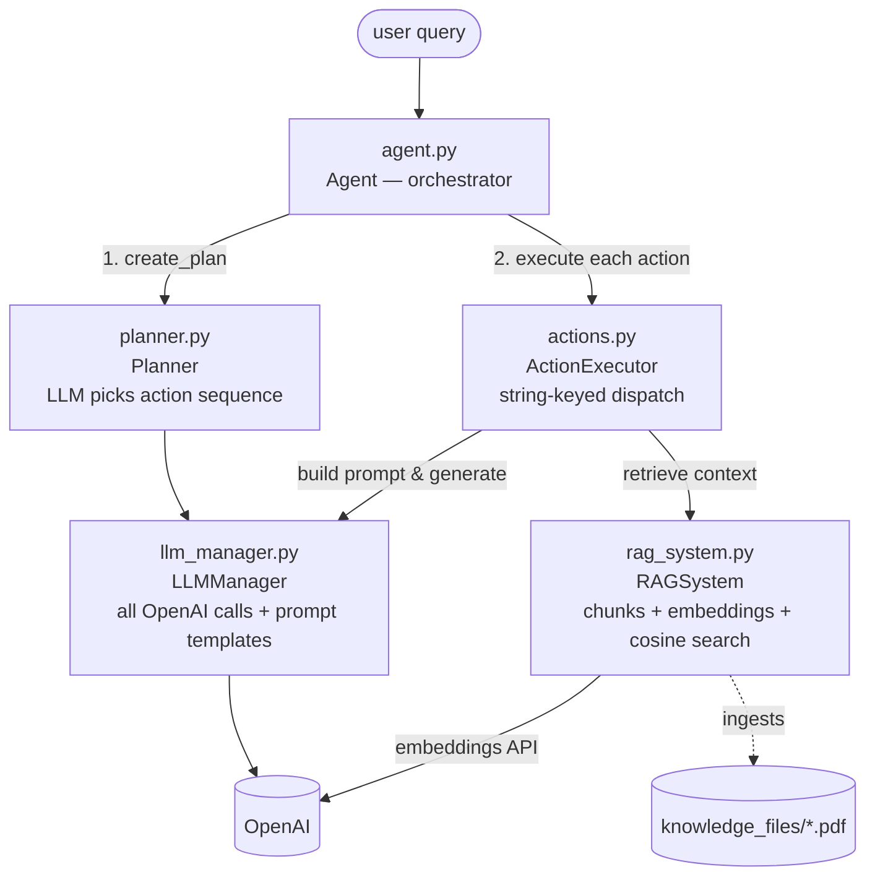

# Tutorial: A Plan-then-Execute RAG Agent from Scratch (KnowledgeAgent)

The other ch04 material is about *where the model runs* (Bedrock/SageMaker). This project
(`ch04/KnowledgeAgent`) is about *what you build on top of a model-serving API*: a small but
complete **RAG agent** — PDF ingestion, embeddings, vector search, LLM-based planning, and
action execution — in ~7 plain-Python files with **no framework** (no LangChain, no vector
DB). That makes it ideal for learning, because every moving part of a RAG agent is visible
in ordinary code.

---

## 1. The big picture

Ask it *"Summarize how 5-level paging works"* and it will:

1. **Plan** — ask the LLM which of its 4 actions to run, in what order
   (here: `query_rag_with_context` → `generate_summary`),
2. **Retrieve** — embed the query, cosine-match it against pre-embedded PDF chunks,
3. **Execute** — run each planned action, chaining one action's output into the next,
4. **Answer** — return the last action's output as the final response.



The wiring is plain constructor injection (`Agent.__init__`):

```python
self.rag_system = RAGSystem()
self.llm_manager = LLMManager()
self.planner = Planner(self.llm_manager)                          # plans BY calling the LLM
self.action_executor = ActionExecutor(self.rag_system, self.llm_manager)
```

| Component | File | Job | Analogy |
|---|---|---|---|
| **Agent** | `agent.py` | orchestrates plan → execute → respond; CLI REPL | the project manager |
| **Planner** | `planner.py` | LLM picks an action sequence (JSON), heuristic fallback | the strategist |
| **ActionExecutor** | `actions.py` | dispatches 4 named actions | the toolbox |
| **RAGSystem** | `rag_system.py` | PDFs → chunks → embeddings → cosine search | the librarian |
| **LLMManager** | `llm_manager.py` | one `generate_response()` + 5 prompt templates | the phone line to the model |
| **Config** | `config.py` | env-driven settings (`.env` via dotenv) | the settings panel |

---

## 2. The RAG pipeline (`rag_system.py`)

### Ingestion: PDFs → token chunks → embeddings

Text comes out of PDFs with `PyPDF2` (`page.extract_text()` concatenated). Chunking is a
**sliding window measured in tokens, not characters**, using `tiktoken`:

```python
def _split_text(self, text: str) -> List[str]:
    tokens = self.encoding.encode(text)
    chunks = []
    for i in range(0, len(tokens), self.config.CHUNK_SIZE - self.config.CHUNK_OVERLAP):
        chunk_tokens = tokens[i:i + self.config.CHUNK_SIZE]
        chunk_text = self.encoding.decode(chunk_tokens)
        if chunk_text.strip():
            chunks.append(chunk_text.strip())
    return chunks
```

With the defaults `CHUNK_SIZE=1000`, `CHUNK_OVERLAP=200`, the loop *strides by 800* tokens —
each chunk shares its first 200 tokens with the previous chunk's tail, so a sentence cut at
a boundary still appears whole in one of the two chunks.

All chunk texts go to OpenAI's embeddings API **in one batched call**
(`text-embedding-3-small` by default).

### The "vector store" is three parallel Python lists

There is deliberately no vector database:

- `self.documents` — dicts of `content / source / file_path / chunk_id`
- `self.embeddings` — float vectors
- `self.metadata` — `source / chunk_id`

Search is brute-force cosine similarity over everything, then top-k:

```python
def cosine_similarity(self, vec1, vec2) -> float:
    vec1 = np.array(vec1); vec2 = np.array(vec2)
    return np.dot(vec1, vec2) / (np.linalg.norm(vec1) * np.linalg.norm(vec2))
```

`get_context_for_query()` then formats the top chunks as
`Document {i} (Source: {source}): {content}` — the source labels let the RAG prompt demand
citations.

**Two honest caveats** (worth knowing before you copy this pattern):

- **No persistence.** `save_vector_db`/`load_vector_db` exist but are commented out, so the
  KB is re-extracted and **re-embedded on every run** (real API cost). The
  `VECTOR_DB_PATH` config is currently dead.
- **A score bug in `search()`**: the top-k *documents* are selected correctly, but the
  `score` attached to each result is looked up by loop counter instead of sorted rank, so
  reported scores don't match their documents.

---

## 3. Planning: the LLM as a router (`planner.py`)

The agent has a fixed vocabulary of exactly four actions:

```python
self.available_actions = [
    "query_rag_with_context",          # answer strictly from retrieved context, with citations
    "generate_profile_based_response", # adapt tone/depth to the user profile
    "generate_summary",                # word-limited summary
    "generate_analysis",               # structured analysis/comparison
]
```

`create_plan(query)` sends the LLM a prompt listing these actions and asks for JSON
(temperature 0.3 — lower than the 0.7 used for answering, since planning should be
deterministic-ish):

```json
{"plan": ["query_rag_with_context", "generate_summary"],
 "reasoning": "User wants a summary, so we need to get context and then summarize",
 "estimated_steps": 2}
```

Two robustness patterns worth stealing:

1. **Tolerant JSON extraction** — `_parse_plan_response` finds the first `{` and last `}`
   rather than trusting the LLM to return bare JSON.
2. **Heuristic fallback** — if parsing fails, `_create_fallback_plan` routes by keywords:
   *what/how/explain* → RAG query only; *summarize/brief* → RAG + summary;
   *analyze/compare/evaluate* → RAG + analysis; anything else → RAG + profile response.
   The agent degrades gracefully instead of crashing on a malformed plan.

`validate_plan` rejects any plan containing an action outside `available_actions` — the LLM
can *order* the tools but can't invent new ones.

---

## 4. Execution: sequential actions with context chaining (`agent.py`, `actions.py`)

This is **plan-then-execute**, not a ReAct loop: the plan is made once up front, then the
actions run in order. The interesting bit is how results chain — one action's output becomes
the next action's *context*, but only if it's substantial:

```python
for i, action in enumerate(action_sequence):
    if not self.action_executor.validate_action_prerequisites(action):
        continue
    result = self.action_executor.execute_action(action, query, context, self.user_profile)
    results.append(result)
    if result and len(result) > 50:   # only substantial results become context
        context = result
```

So for *"summarize X"*: `query_rag_with_context` retrieves and answers from the PDFs, and
`generate_summary` then summarizes *that answer* rather than doing its own retrieval. Each
action follows the same internal shape: **use upstream context if given, else retrieve via
RAG → build a task-specific prompt → generate.**

Dispatch is a plain string-keyed if/elif in `ActionExecutor.execute_action` (raising
`ValueError` on unknown names), and `validate_action_prerequisites` gates everything on the
knowledge base being non-empty. Per-action errors are caught and recorded as strings so one
failed step doesn't abort the sequence.

There's also an escape hatch: `process_query(query, use_planning=False)` skips the planner
entirely and just does a single RAG answer — useful to compare with/without planning.

---

## 5. The LLM layer (`llm_manager.py`)

All prompt text lives in one place — five builder methods (`create_planning_prompt`,
`create_rag_prompt`, `create_profile_based_prompt`, `create_summary_prompt`,
`create_analysis_prompt`) — and every call funnels through a single method:

```python
response = self.client.chat.completions.create(
    model=self.config.LLM_MODEL,
    messages=[{"role": "user", "content": prompt}],
    max_tokens=max_tokens,
    temperature=temperature,
)
return response.choices[0].message.content
```

Notable choices: the RAG prompt instructs the model to answer **only from the provided
context and cite sources** (the classic anti-hallucination guardrail), and API errors are
returned as error *strings* rather than raised — simple, though it means callers can't
distinguish an answer from a failure programmatically.

---

## 6. Setup, config, and the examples

**Run it:** `pip install -r requirements.txt`, copy `env_example.txt` → `.env`, set
`OPENAI_API_KEY`, drop PDFs in `knowledge_files/`, then `python agent.py` for the REPL — or
programmatically: `Agent()` → `build_knowledge_base()` → `process_query(...)`.

Key config (env vars, loaded by `config.py` at import):

| Var | Default | Notes |
|---|---|---|
| `OPENAI_API_KEY` | — | required; `RAGSystem`/`LLMManager` raise `ValueError` without it |
| `LLM_MODEL` | `gpt-4.1-nano` | README says `gpt-4` — the code is the truth. Also picks the tiktoken encoder (newer model names may not be known to older tiktoken versions). |
| `EMBEDDING_MODEL` | `text-embedding-3-small` | |
| `CHUNK_SIZE` / `CHUNK_OVERLAP` | 1000 / 200 | **tokens**, not characters |
| `TEMPERATURE` | 0.7 | planner overrides to 0.3 |

The bundled `knowledge_files/` PDFs are systems papers (Intel 5-level paging, SAL
annotations, OLAP/data mining, HTM Patricia tries) — the sample queries target these.

`example_usage.py` walks six demos: basic Q&A with planning, a custom beginner/business
user profile, direct vector search (`search_knowledge_base`, bypassing the LLM), system
status introspection, save/load of the KB, and how different query types produce different
plans. **Heads-up:** the save/load demo calls `agent.save_knowledge_base(...)`, which
doesn't exist (persistence is the commented-out code from §2) — it will raise
`AttributeError`. Treat it as aspirational.

---

## 7. Lessons to carry forward

1. **A RAG agent is small.** Ingest → chunk (with overlap, in tokens) → embed → cosine
   top-k → prompt-with-context is a few hundred lines; frameworks add convenience, not magic.
2. **Plan-then-execute is the simplest useful agent shape.** One LLM call to choose a
   sequence from a *fixed, validated* action vocabulary, then deterministic execution with
   context chaining. No loop, no self-correction — and often that's enough.
3. **Never trust LLM output syntactically.** Tolerant JSON extraction + a keyword fallback
   plan is what makes the planner production-ish.
4. **Know when the toy stops scaling:** brute-force in-memory search and re-embedding on
   every start are fine for four PDFs; a real system needs persistence and an ANN index —
   exactly the gap a vector DB fills.
